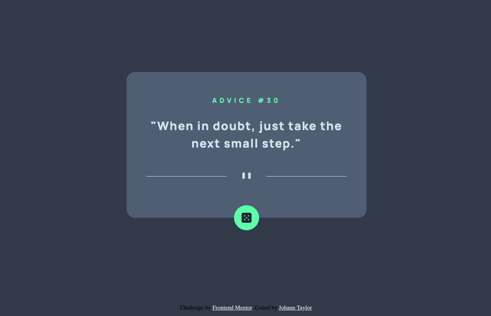

# Frontend Mentor - Advice generator app

## Table of contents

- [Overview](#overview)
  - [The challenge](#the-challenge)
  - [Screenshot](#screenshot)
  - [Links](#links)
  - [Built with](#built-with)
- [Author](#author)
- [Acknowledgments](#acknowledgments)

## Overview

### The challenge

The purpose of this challenge is to build a responsive advice generator app using the [Advice Slip API](https://api.adviceslip.com/).

Users should be able to:

- View the optimal layout for the app depending on their device's screen size
- See hover states for all interactive elements on the page
- Generate a new piece of advice by clicking the dice icon

### Screenshot

### Links
- Link to live site: [Advice Generator](https://johannt91.github.io/advice-generator/)

### Built with

- Semantic HTML5 markup
- CSS custom properties
- Flexbox
- Mobile-first workflow

## Author

- Website - [Johann Taylor](https://www.johanntaylor.com)